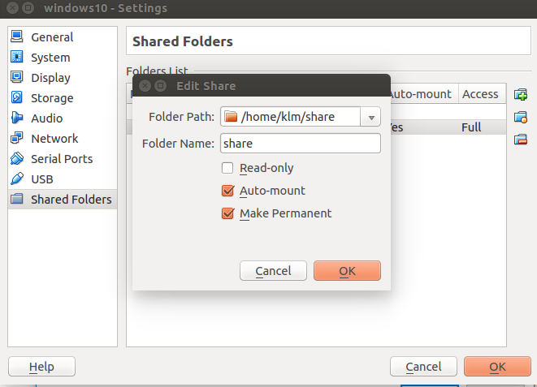
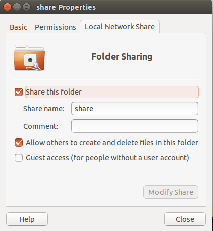
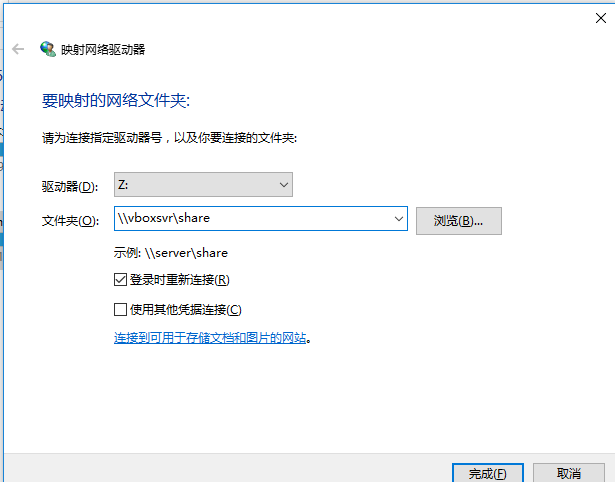
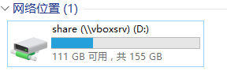

# Ubuntu 中安装 windows10  

ubuntu 下使用 virtualbox 虚拟机安装试用 win10 系统...     

[Oracle_VM_VirtualBox_Extension_Pack-5.2.10.vbox-extpack](https://www.downloadcrew.com/article/20279-virtualbox_extension_pack)
 
1. 输入如下的命令安装virtualbox虚拟机。    

```bash
$ sudo apt-get install virtualbox
```

2. 创建安装`win10`的磁盘空间   

2.1 在dash菜单搜索virtualbox并打开。   
2.2 选择 “新建”，名称输入“windows10”，类型选择“microsoft windows”,版本选择“windows 10(具体32位还是64位根据你下载的win10系统定)”，然后“下一步”。   
2.3 虚拟硬盘，选择“现在创建虚拟硬盘”，然后“创建”。虚拟硬盘文件类型就选择默认的“VDI (VirtualBox硬盘映像)”，“下一步”。   
2.4 存储在物理硬盘上，选择默认的“动态分配(D)”，“下一步”。   
2.5 文件位置和大小，位置不需要动，默认是“用户/VirtualBox VMs文件夹”，硬盘大小默认是32G，这里我也是默认的，“创建”，然后就会多出个“windows10”。 

3. 给虚拟机安装 windows10 操作系统    

3.1 选中“windows10”，点击 “设置”。   
3.2 选择 “存储”，选择右边的 “没有盘片（empty）”，点击右边的小光盘图标，“选择一个光盘文件”，然后找到自己的windows10的iso文件位置选中它。   
3.3 完成设置后，选择“windows10”，点击“启动”，开始运行虚拟机。   
3.4 默认就是“中文(简体，中文)”，如果不是重新选择，“下一步”。点击“现在安装”。   
3.5 因为是虚拟机，还没有安装过系统，所以我选择 “自定义：仅安装 Windows (高级)”   
3.6 直接选择默认的驱动器，“下一步”。下面就慢慢的等待它漫长的安装过程吧。   

4. 安装增强插件让windows更好用

4.1 选择 “设备”--“安装增强功能” ，第一次使用，这里会提示需要下载增强插件，下载下来就好用了。     
4.2 加载增强插件后，会提示安装，或者在 “此电脑” 中找到 “CD驱动器VirtualBox Guest Addition”， 进入执行其中的  “VboxWindowsAdditions” ，一步一步安装，过程中可能提示不兼容也选择安装。    
4.3 安装完成后，重启自己的windows10就好用多了，桌面可以自适应了。    

5. windows 和 Ubuntu文件共享     

5.1 设置 virtualbox 中主机的共享文件夹   

Settings | Shared Folders | Adds new shared folder

复选框设置为：  

- [x] Auto-mount  
- [x] Make Permanent  

具体如下图所示：   

  

5.2 设置 shared 文件夹的属性    

在 ubuntu 系统中对上一步中选择的目录进行目录属性设置， 设置选项为：  

- [x] Share this folder  
- [x] Allow others to create and delete files in this folder

具体如下图所示：   

  

5.3 在windows中映射网络驱动器。       

此电脑 | 映射网络驱动器, 输入下面的路径.    

```
\\vboxsvr\share 
```  

   

到此，共享文件夹就设置好了。    

  

## 6. 为 Virtualbox 虚拟硬盘扩容  

可以使用 vboxmanage 命令来为虚拟硬盘扩容．vboxmanage的命令语法如下.  

```bash
vboxmanage modifyhd /path/to/your/virtual/disk --resize size-in-MB
```

虚拟硬盘的容量单位是MB．我输入了下面的命令将我的虚拟硬盘容量扩大到了 70G .

```
vboxmanage modifyhd "/home/matrix/VirtualBox VMs/ubuntu/ubuntu.vdi" --resize 70000
```

注意： 不能使用这个命令来缩减虚拟硬盘的容量．

现在，打开 virtualbox 的设置界面，将虚拟硬盘添加回虚拟机里．点击加号图标，选择添加硬盘．  

然后分配好的硬盘需要使用分区工具合并扩展出的分区到原来的分区后才可以正常使用。  


## 7. virtualbox 不能识别 USB 设置的解决方法

1) 将当前用户添加到一个 USB 用户组   

可以用 vboxusers 这个在安装 VirtualBox 的时候产生的用户组， 把你使用的这个用户加到 vboxusers 组中，确保该用户是否有权限去读写 usbfs 这个文件系统.   

首先, 查看 vboxusers 用户组 gid.   

```bash
cat /etc/group |grep vboxusers 
```

输出信息:   

```bash
vboxusers:x:129:  
```

后面的 129 就是 vboxusers 的 GID.   

接下来把 name 用户加到 vboxusers 组中，后面的 name 就是你要加的用户名.   

```bash
sudo /usr/sbin/usermod -G vboxusers -a [name]

cat /etc/group |grep vboxusers
```

输出信息:   

```bash
vboxusers:x:129:name   
```

此时可以查看到 name 以及被加到此用户组了.   

经过第一步如果仍然不能解决问题，继续下一步：   


```bash
sudo gedit /etc/fstab    #编辑fstab文件
```

在末行加上以下命令,保存

```bash
none /proc/bus/usb usbfs devgid=129,devmode=664 0 0    # 这里 devgid 的值就是你前面所查看的 vboxusers 的 GID
```

重新启动虚拟机，插入一个 USB 设备，右键点击虚拟机右下角的 USB 图标选择你插入的 USB 设备，虚拟机中就可以识别到了.  

## 8. kernel driver not installed 

升级了 kernel 之后，VirtualBox 很容易出现 rc=1908 错误，说 kernel driver not installed，让安装 DKMS。但是装了 DKMS 也还是一样会出现这种情况。   

```bash
sudo /etc/init.d/virtualbox start 
```
