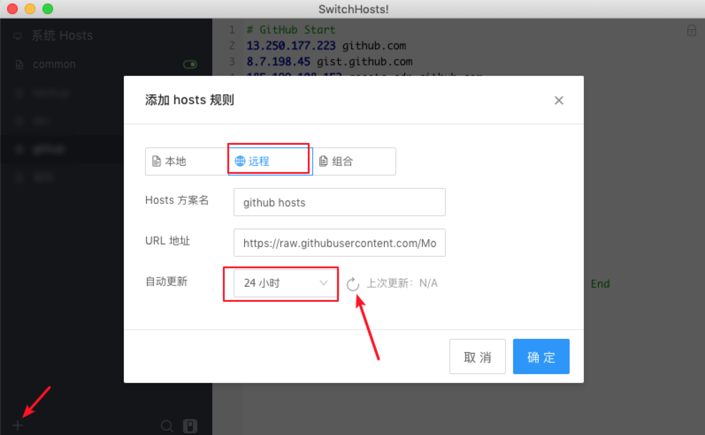
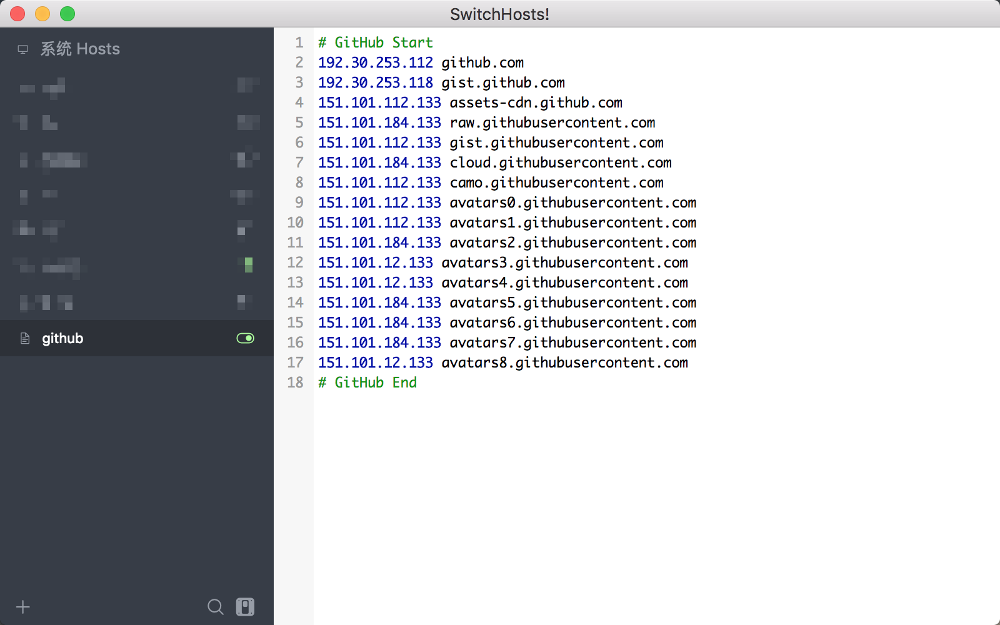

# git clone 加速  

思路: git clone 特别慢是因为 github.global.ssl.fastly.Net 域名被限制了。只要找到这个域名对应的 ip 地址，然后在 hosts 文件中加上 ip–>域名 的映射，刷新 DNS 缓存就可以了.   

下面介绍两种方法, 主要推荐使用第一种.  

## 1. SwitchHosts 管理远程 hosts 文件

> http://nullpointer.pw/github%E4%BB%A3%E7%A0%81clone%E5%8A%A0%E9%80%9F.html

仓库地址：https://github.com/Mosiki/github

使用一个简单的 crontab，每日执行并生成更新 hosts 文件。  


**使用方法**  

最麻烦的方式就是去手动修改 host 文件，最简单的方式就是下载 Switch Host (https://oldj.github.io/SwitchHosts/) 软件进行 host 修改，因为 hosts 文件每日都会自动更新，所以需要本地的 hosts 也能自动更新， 好在 SwitchHosts 提供了远程 hosts 的功能。  
 
(1) 复制如下 hosts 地址   

测试发现GitHub的网址有可能访问不了，因而更换成了码云的镜像仓库地址.  

```bash
https://gitee.com/Mosiki/github/raw/master/github_hosts.txt
```

(2) 新增远程 hosts   

笔者在 mac 下操作，win 是同理。   

   

(3) 设置自动更新  

   

选择 24 小时即可，第一次添加的时候需要手动点击刷新按钮，刷新获取一下远程的 hosts   

更新完成之后点击确定保存即可。  

(4) 打开 hosts 开关   

   

如图设置完，把开关打开就 Ok 了。   

**Tips**: 如果切换到最新 hosts 后还是很慢，可以重新开一个终端尝试，或者断开再重连一下网络，可能是 hosts 还未生效。（switch hosts 在 win 下需要使用管理员身份打开，mac 下需要输入开机密码获得权限）   

如果实在还不行, 就将上面 github 地址中的代码拉下来, 使用本地运行仓库里的 py 代码生成一下 github_hosts.txt 试试.   

## 2. 手动查询并更改 hosts 文件    

1、查询域名 global-ssl.fastly.Net 和 github.com 公网地址.

可以用这个 https://www.ipaddress.com/.   

或者用 [Dns检测|Dns查询 - 站长工具](http://tool.chinaz.com/dns/?type=1&host=github.global.ssl.fastly.net&ip=).   

分别查找检测列表里的 TTL 值最小的 IP.  

- github.global.ssl.fastly.net  
- github.com  

这两个域名的 ip 地址.  

或者使用 nslookup 工具查询.  

```bash
$ nslookup github.global.ssl.fastly.Net
Server:  127.0.0.53
Address: 127.0.0.53#53

Non-authoritative answer:
Name: github.global.ssl.fastly.Net
Address: 151.101.229.194

$ nslookup github.com
Server:  127.0.0.53
Address: 127.0.0.53#53

Non-authoritative answer:
Name: github.com
Address: 13.229.188.59
```

2、将 ip 地址添加到 hosts 文件  

```conf
sudo gedit /etc/hosts
# 写入下面两行, 注意使用 tab 作为分割符
13.250.177.223	github.com
151.101.229.194	github.global.ssl.fastly.net
```

保存退出. 如果速度没有明显提升, 建议换一个 ip 重试.  

3、刷新 DNS 缓存   

修改完 hosts 还不会立即生效，你需要刷新 DNS 缓存，告诉电脑 hosts 文件已经修改了。  

输入指令:    

```bash
sudo /etc/init.d/networking restart  
```

windows 下刷新 DNS 的方法:   

打开 CMD   

输入  ipconfig /flushdns.  


4、重新运行git clone   

此方法也可以解决访问 github 网站慢的问题.   